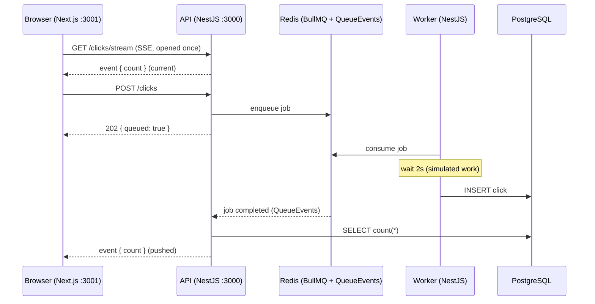
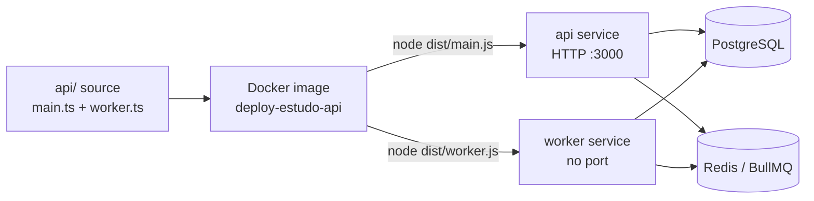

# Deploy Study — Async Click Counter

[](https://www.typescriptlang.org/)
[](https://nestjs.com/)
[](https://bullmq.io/)
[](https://www.prisma.io/)
[](https://www.postgresql.org/)
[](https://redis.io/)
[](https://nextjs.org/)
[](https://www.docker.com/)

**🌐 English** · [Português](README.pt-BR.md)

A deliberately **minimal anchor project** to exercise a complete deployment
stack: frontend + long-running API + queue worker + Postgres + Redis.

The app itself is intentionally trivial — a button that increments a counter.
The value is in the **stack** and the **end-to-end asynchronous flow**, not in
the feature. It's a sandbox for learning how to ship a multi-service system.

## The flow

1. The frontend has a **"Register click"** button and shows **"Processed clicks"**.
2. A click sends `POST /clicks` to the API.
3. The API **enqueues a job** on BullMQ and immediately responds `202 { queued: true }`.
4. The **worker** (a separate process) consumes the job, waits **2s on purpose**
   (simulating real work), and writes a row into the `clicks` table in Postgres.
5. The frontend subscribes to `GET /clicks/stream` (Server-Sent Events) and
   updates the number in **real time** — the API pushes the new count whenever
   the worker finishes a job. No polling.

The 2s delay is intentional: it makes it visible that a different process does
the work — the number goes up *after* the click.



> **Why SSE instead of polling?** Polling every 1.5s sends thousands of
> requests per open tab even when nothing changes. With Server-Sent Events the
> API only emits when the worker actually finishes a job, so the idle cost is
> ~zero — handy when the deploy target bills per request or per active time.

## Core concept: one image, two processes

`api` and `worker` are **two entry points of the same source code**
(`dist/main.js` and `dist/worker.js`), built into the **same Docker image**. In
production they become two services that differ only in their start command.



## Stack

| Layer            | Technology                  |
| ---------------- | --------------------------- |
| API + worker     | NestJS 11 (TypeScript)      |
| Queue            | BullMQ + Redis              |
| Database / ORM   | PostgreSQL + Prisma         |
| Frontend         | Next.js 15 (App Router)     |
| Orchestration    | Docker Compose              |

## Structure

```
.
├── docker-compose.yml   # postgres + redis + api + worker
├── .env.example         # required variables
├── api/                 # NestJS: web API (main.ts) + worker (worker.ts)
└── web/                 # Next.js: one page (button + number + polling)
```

## Getting started

Prerequisites: **Docker** (with the daemon running) and **Node 20+** (for the frontend).

### 1. Environment variables

```bash
cp .env.example .env
```

### 2. Start the stateful half (api + worker + postgres + redis)

```bash
docker compose up --build
```

This brings up the four services. The API applies the Prisma migration
(`prisma migrate deploy`) before it starts serving.

- API: http://localhost:3010 (host port 3000 is often already taken, so the API
  is published as **3010 → 3000**; adjust in `docker-compose.yml` if you like)
- `POST /clicks` → `202 { "queued": true }`
- `GET /clicks/count` → `{ "count": n }` (one-shot read; handy for curl)
- `GET /clicks/stream` → Server-Sent Events stream of `{ "count": n }`

> Postgres and Redis **do not** publish host ports (they are reached only over
> the compose internal network) to avoid clashing with local instances.

### 3. Start the frontend (outside the compose)

In another terminal:

```bash
cd web
npm install      # first time
npm run dev      # http://localhost:3001
```

Open http://localhost:3001, click the button, and watch the number go up ~2s
later. Follow the `worker` logs in the compose terminal to see it picking up and
finishing each job.

> The frontend reads the API URL from `NEXT_PUBLIC_API_URL`. Create
> `web/.env.local` with `NEXT_PUBLIC_API_URL=http://localhost:3010` so
> `npm run dev` targets the right API.

## Running the API/worker locally without Docker (optional)

You'll need a reachable Postgres and Redis. Point `.env` at `localhost` and:

```bash
cd api
npm install
npx prisma migrate deploy
npm run start:dev        # API (port 3000)
npm run start:worker:dev # worker, in another terminal
```

## Persistence

Postgres uses a named volume (`postgres_data`). Tearing the stack down and
bringing it back up (`docker compose down && docker compose up`) **keeps the
count**. To reset for real: `docker compose down -v`.

## Out of scope (on purpose)

No authentication, no automated tests, no CI/CD, no cloud deploy. Those are a
later phase, done separately.
