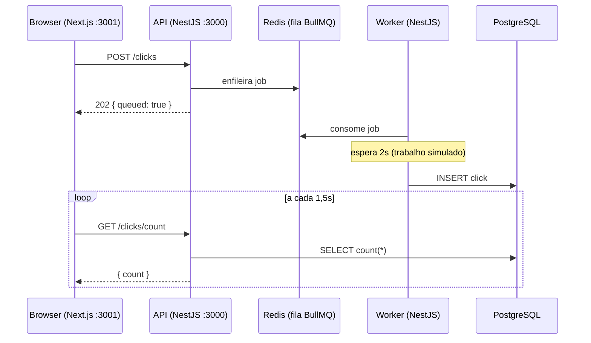
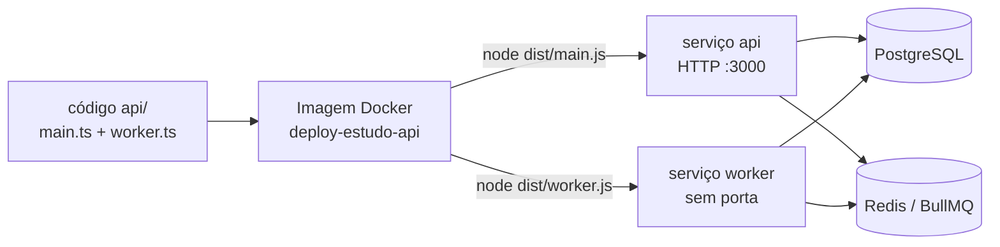

# Estudo de Deploy — Contador de Cliques Assíncrono

[](https://www.typescriptlang.org/)
[](https://nestjs.com/)
[](https://bullmq.io/)
[](https://www.prisma.io/)
[](https://www.postgresql.org/)
[](https://redis.io/)
[](https://nextjs.org/)
[](https://www.docker.com/)

[English](README.md) · **🌐 Português**

Um **projeto-âncora** deliberadamente mínimo para exercitar um stack completo de
deploy: frontend + API de longa duração + worker de fila + Postgres + Redis.

A aplicação em si é proposital e trivial — um botão que incrementa um contador.
O valor está no **stack** e no **fluxo assíncrono ponta a ponta**, não na
feature. É um laboratório para aprender a *shippar* um sistema multi-serviço.

## O fluxo

1. O frontend tem um botão **"Register click"** e mostra **"Processed clicks"**.
2. O clique faz `POST /clicks` na API.
3. A API **enfileira um job** no BullMQ e responde na hora `202 { queued: true }`.
4. O **worker** (processo separado) consome o job, espera **2s de propósito**
   (simula trabalho real) e grava uma linha na tabela `clicks` do Postgres.
5. O frontend faz polling em `GET /clicks/count` a cada 1,5s e atualiza o número.

O delay de 2s é intencional: deixa visível que outro processo faz o trabalho —
o número sobe *depois* do clique.



## Conceito central: uma imagem, dois processos

`api` e `worker` são **dois entry points do mesmo código-fonte**
(`dist/main.js` e `dist/worker.js`), construídos na **mesma imagem Docker**. Em
produção viram dois serviços que diferem só no comando de start.



## Stack

| Camada           | Tecnologia                  |
| ---------------- | --------------------------- |
| API + worker     | NestJS 11 (TypeScript)      |
| Fila             | BullMQ + Redis              |
| Banco / ORM      | PostgreSQL + Prisma         |
| Frontend         | Next.js 15 (App Router)     |
| Orquestração     | Docker Compose              |

## Estrutura

```
.
├── docker-compose.yml   # postgres + redis + api + worker
├── .env.example         # variáveis necessárias
├── api/                 # NestJS: API web (main.ts) + worker (worker.ts)
└── web/                 # Next.js: uma página (botão + número + polling)
```

## Como rodar

Pré-requisitos: **Docker** (com o daemon ligado) e **Node 20+** (para o frontend).

### 1. Variáveis de ambiente

```bash
cp .env.example .env
```

### 2. Sobe a metade stateful (api + worker + postgres + redis)

```bash
docker compose up --build
```

Isso sobe os quatro serviços. A API aplica a migration do Prisma
(`prisma migrate deploy`) antes de começar a servir.

- API: http://localhost:3010 (a porta 3000 do host costuma estar ocupada, então
  publicamos a API em **3010 → 3000**; ajuste no `docker-compose.yml` se quiser)
- `GET /clicks/count` → `{ "count": n }`
- `POST /clicks` → `202 { "queued": true }`

> Postgres e Redis **não** publicam portas no host (são acessados só pela rede
> interna do compose), para não conflitar com instâncias locais.

### 3. Sobe o frontend (fora do compose)

Em outro terminal:

```bash
cd web
npm install      # primeira vez
npm run dev      # http://localhost:3001
```

Abra http://localhost:3001, clique no botão e veja o número subir ~2s depois.
Acompanhe os logs do `worker` no terminal do compose para vê-lo pegando e
concluindo cada job.

> O frontend lê a URL da API de `NEXT_PUBLIC_API_URL`. Crie o arquivo
> `web/.env.local` com `NEXT_PUBLIC_API_URL=http://localhost:3010` para o
> `npm run dev` apontar para a API certa.

## Rodando a API/worker localmente sem Docker (opcional)

Precisa de um Postgres e um Redis acessíveis. Ajuste o `.env` apontando para
`localhost` e:

```bash
cd api
npm install
npx prisma migrate deploy
npm run start:dev        # API (porta 3000)
npm run start:worker:dev # worker, em outro terminal
```

## Persistência

O Postgres usa um volume nomeado (`postgres_data`). Derrubar e subir o compose
(`docker compose down && docker compose up`) **mantém a contagem**. Para zerar
de verdade: `docker compose down -v`.

## Fora do escopo (de propósito)

Sem autenticação, sem testes automatizados, sem CI/CD, sem deploy em nuvem.
Isso é fase posterior, feita separadamente.
